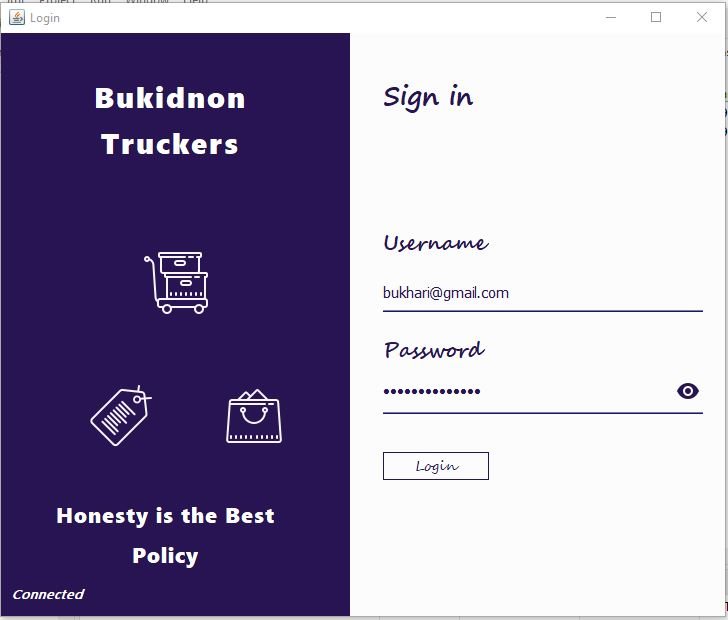
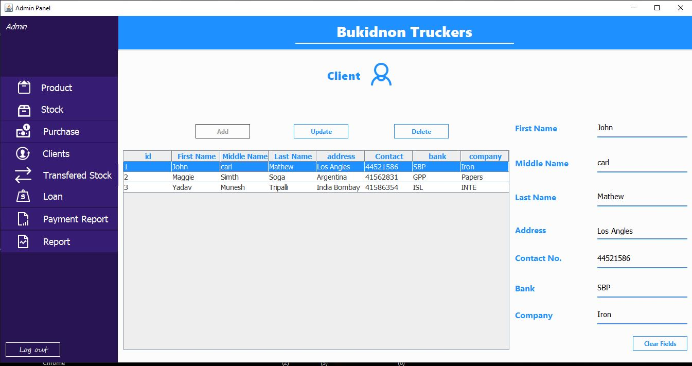
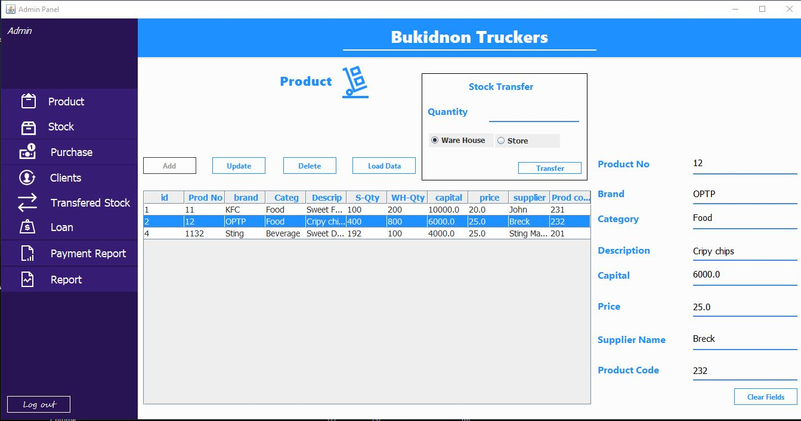
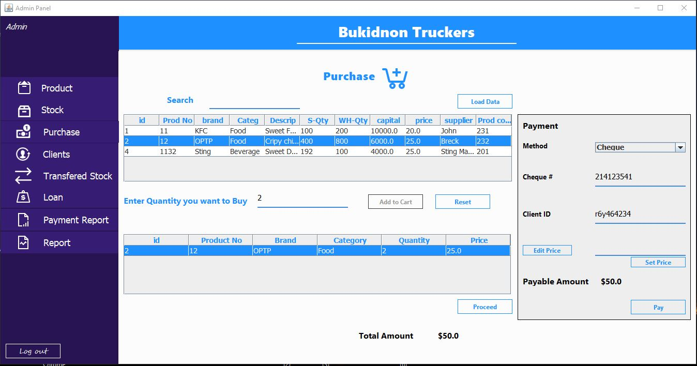
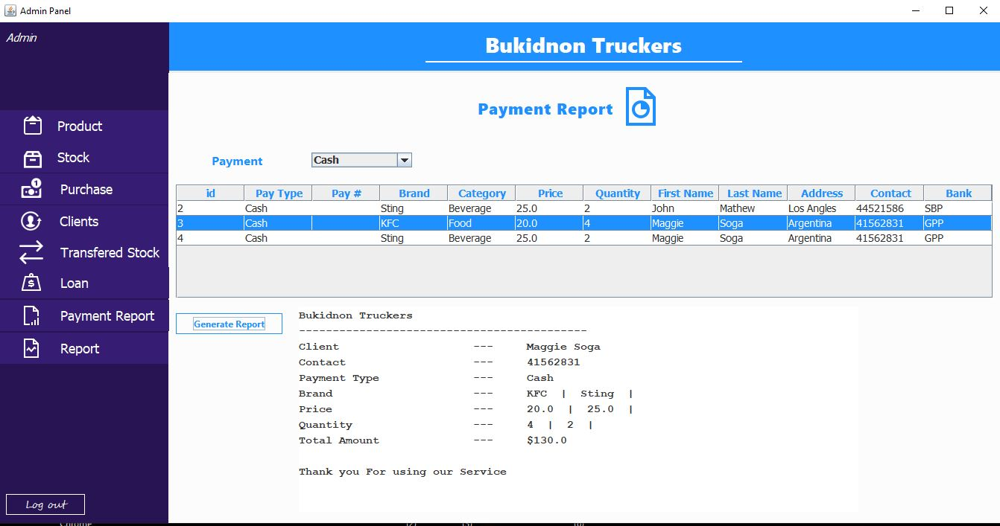
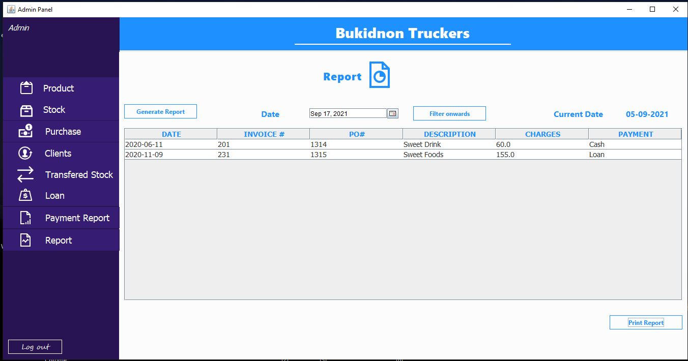
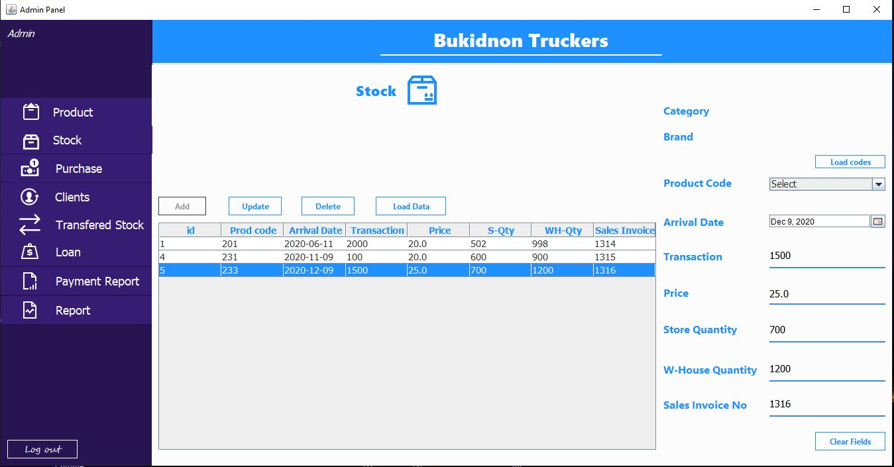
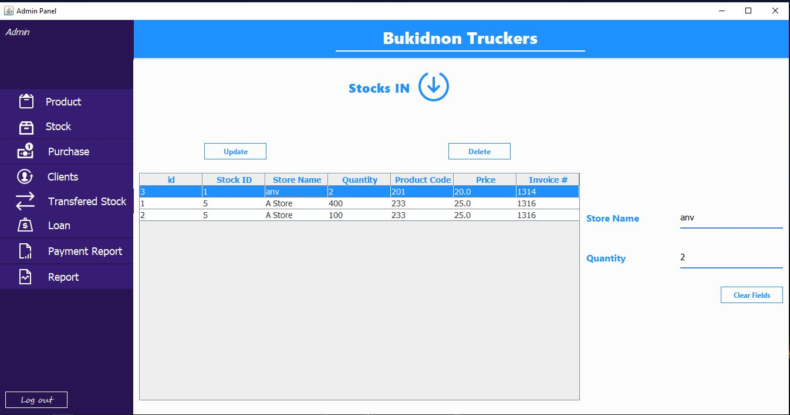
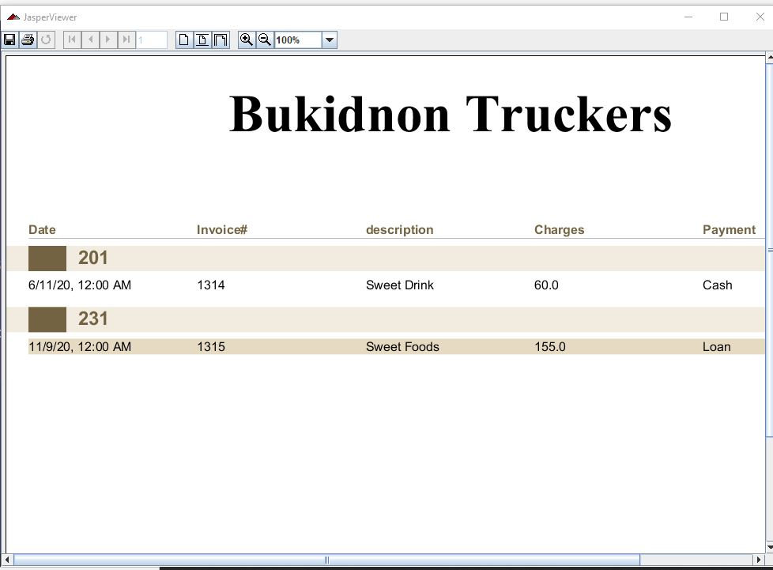

# Shop-Management-System

A Desktop Application written in Java Swing to automate the activities of a shop.

### Login

### Client

### Product

### Purchase

### Payment Report

### Report

### Stock

### Tranfered Stock

### Report(Jasper)

